  

# Context-Aware Venue Recommendation Using Machine Learning-

DATASET: 
- https://sites.google.com/site/yangdingqi/home/foursquare-dataset (All Foursquare Dataset)
- https://drive.google.com/file/d/0BwrgZ-IdrTotZ0U0ZER2ejI3VVk/view?usp=sharing (Specific Dataset we utilized)

> A context-aware recommender system recommends user the items that relevant to the current contexts such as time, location or weather. Generally, the venue recommender system repeatedly suggests the same places every time that user requests for the attractive venues around the location. In fact, individual user has diverse interested in visiting places based on personalized activities according to time of day. To improve the venue recommendation, We propose a context-aware venue recommender system. The contexts focus on the location of device and time of day. 
> The result reveals that the proposed method improves the recommended venues every time user has an activity with the application, which based on the contexts and the personalized activities of an individual user.

**DATA ANALYSIS:**

1.  **Data Collection:**

2.  **Platform for Dataset:**

>   Foursquare was created in 2009 and it has quickly become the most popular
>   location-based service, with more than 55 million worldwide with over 6
>   billion check-ins as of January 2019. On Foursquare, users can explore
>   interesting venues such as restaurants, museums, popular bars, department
>   stores with specials (e.g., discounts, coupons), etc., around their current
>   locations. Users can also add other users as their friends just as they do
>   in traditional social networks and they can also create friendship links
>   with users in the nearby venues. Foursquare users can create and add a
>   venue/Point of Interest (POI; we use both terminologies in this
>   dissertation) in Foursquare and they can click “Check in” at the venues
>   where they currently are by using a Foursquare mobile App and share such
>   information with others. Users can choose either public “Checkin” or private
>   “Check in”, and they can earn points by checking in. A user can explore
>   venues around him to find interesting ones and view other people who are
>   checked in there. Users can also easily add friends as they usually do in
>   traditional social networks such as Facebook. They can also choose to post
>   their Foursquare check-ins on Facebook or Twitter in order to share their
>   location information or activity information with more users.

1.  **About our Dataset:**

We have used foursquare dataset publicly available on Internet. The Dataset
contains check-ins in NYC and Tokyo collected for about 10 month (from 12 April
2012 to 16 February 2013). It contains 227,428 check-ins in New York city and
573,703 check-ins in Tokyo. Each

check-in is associated with its time stamp, its GPS coordinates and its semantic
meaning (represented by fine-grained venue-categories). This dataset is
originally used for studying the spatial-temporal regularity of user activity in
LBSNs. The attributes of the dataset are:

-   User ID (anonymized)

-   Venue ID (Foursquare)

-   Venue category ID (Foursquare)

-   Venue category name (Foursquare)

-   Latitude

-   Longitude

-   Timezone offset in minutes

-   **Proposed Methodology:**

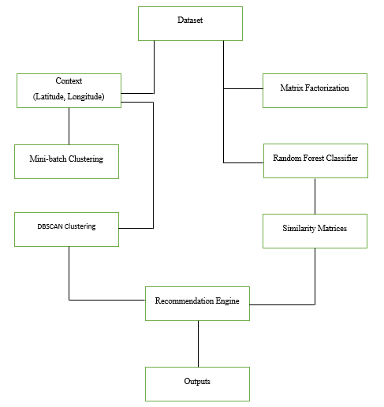

**Cold Start Problem:**

The term derives from cars. When it’s really cold, the engine has problems with
starting up, but once it reaches its optimal operating temperature, it will run
smoothly. With recommendation engines, the “cold start” simply means that the
circumstances are not yet optimal for the engine to provide the best possible
results. Our dataset was facing cold start problem as we did not had Ratings,
Review or any other information. To solve this problem, We derived a new
attribute from the data by calculating User visits to a specific Venue.

**Visualization & Exploration of Dataset:**

1.  **Summary of The Dataset**

    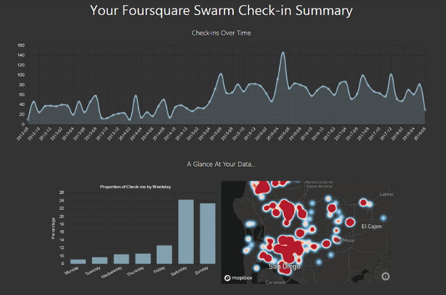

    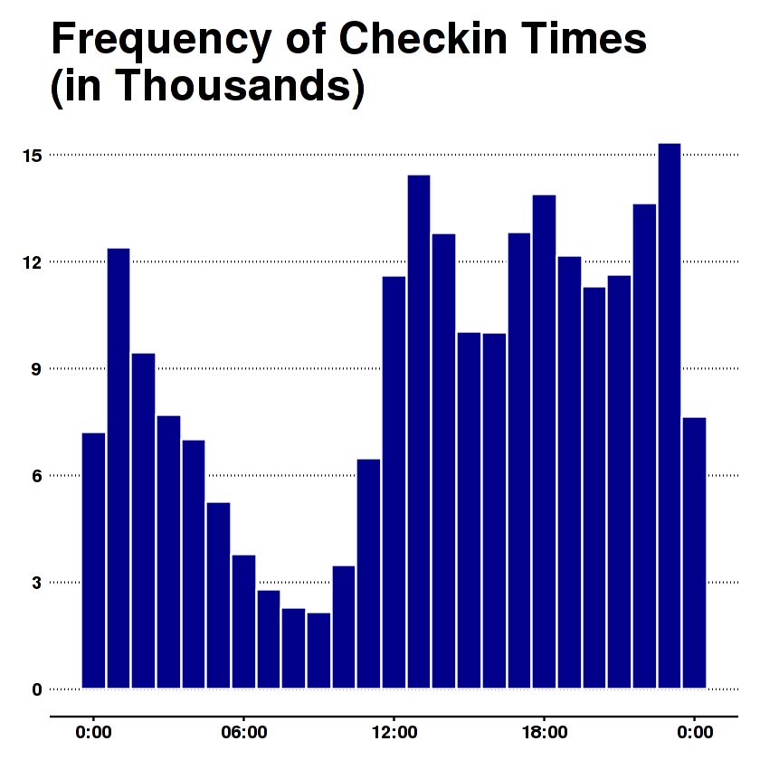

2.  **check-ins in NYC and Tokyo**

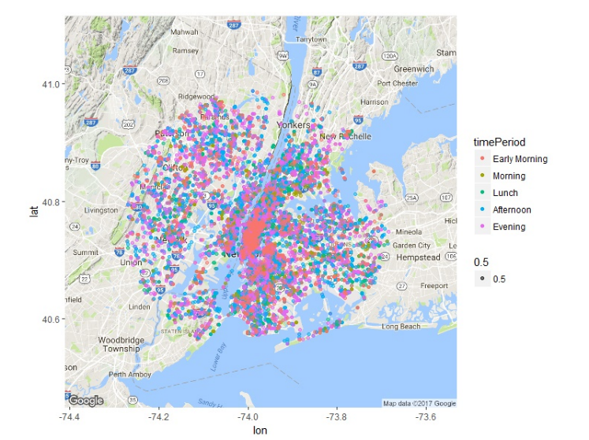

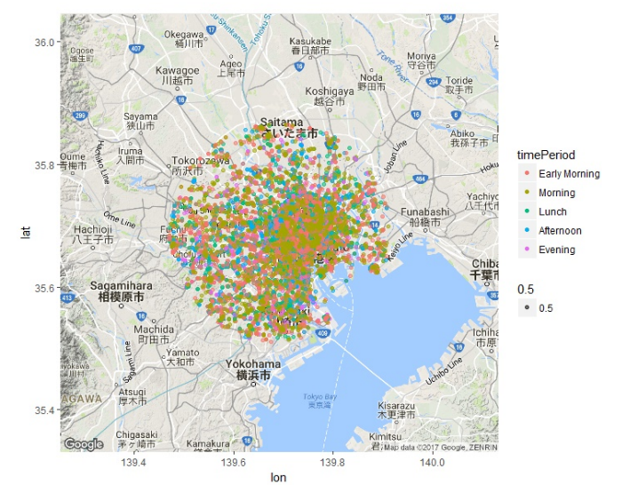

1.  **Hot Venues and Categories:**

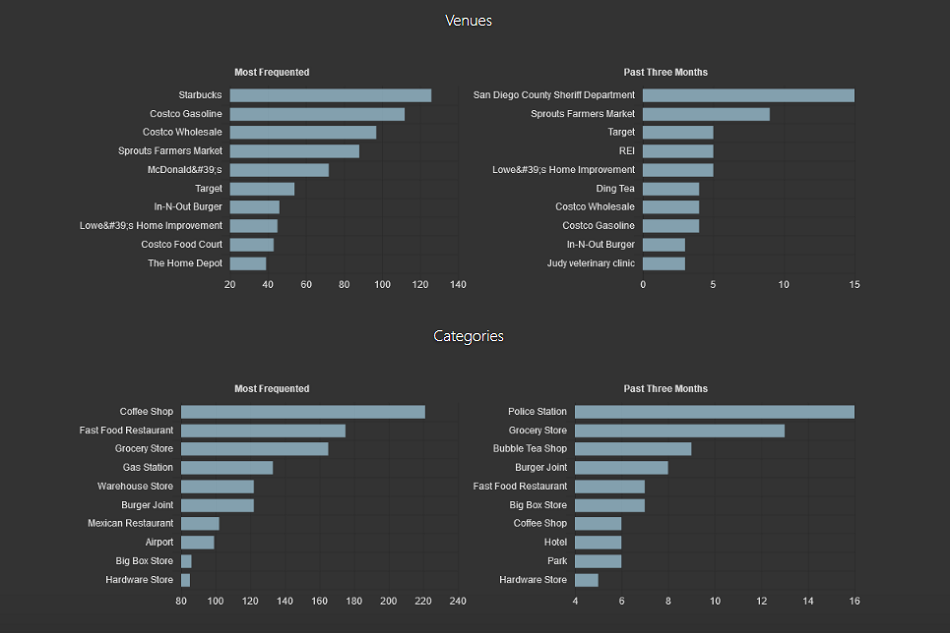

1.  **Top Categories**

    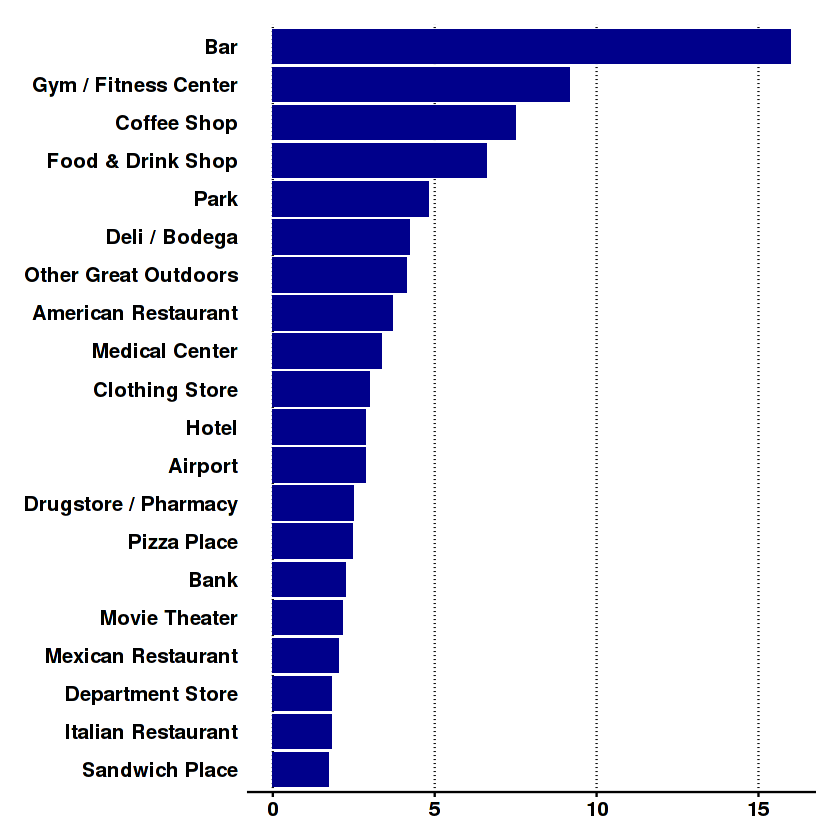

**Context Clustering:**

1.  **Minibatch K Means Clustering:**

>   Mini Batch K-means algorithm’s main idea is to use small random batches of
>   data of a fixed size, so they can be stored in memory. Each iteration a new
>   random sample from the dataset is obtained and used to update the clusters
>   and this is repeated until convergence. Each mini batch updates the clusters
>   using a convex combination of the values of the prototypes and the data,
>   applying a learning rate that decreases with the number of iterations.

>   Given: k, mini-batch size b, iterations t, data set X

>   Initialize each c ∈ C with an x picked randomly from X

>   v ← 0

>   for i = 1 to t do

>   M ← b examples picked randomly from X

>   for x ∈ M do

>   d[x] ← f (C, x) // Cache the center nearest to x

>   end for

>   for x ∈ M do

>   c ← d[x] // Get cached center for this x

>   v[c] ← v[c] + 1 // Update per-center counts

>   η ← 1 / v[c] // Get per-center learning rate

>   c ← (1 − η)c + ηx // Take gradient step

>   end for

>   end for

>   Results:

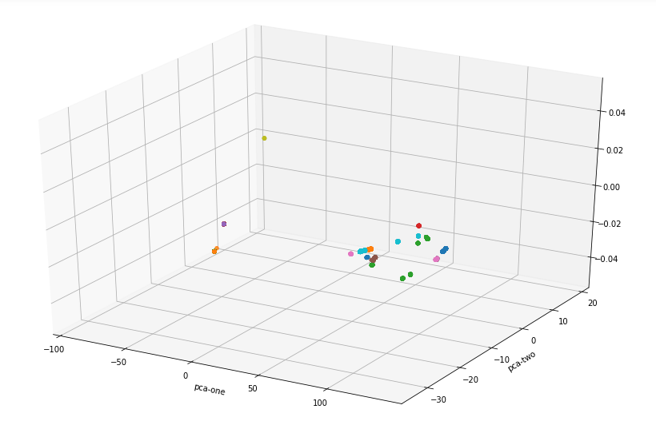

>   Minibatch Evaluation by Euclidean: 0.90903859

1.  **DBSCAN:**

    Density-based spatial clustering of applications with noise (DBSCAN) is a
    well-known data clustering algorithm that is commonly used in data mining
    and machine learning. K-Means is easy to understand and implement in
    practice, the algorithm has no notion of outliers, so all points are
    assigned to a cluster even if they do not belong in any. In the domain of
    anomaly detection, this causes problems as anomalous points will be assigned
    to the same cluster as “normal” data points. The anomalous points pull the
    cluster centroid towards them, making it harder to classify them as
    anomalous points.

    Unlike K-Means, DBSCAN does not require the number of clusters as a
    parameter. Rather it infers the number of clusters based on the data, and it
    can discover clusters of arbitrary shape (for comparison, K-Means usually
    discovers spherical clusters).

    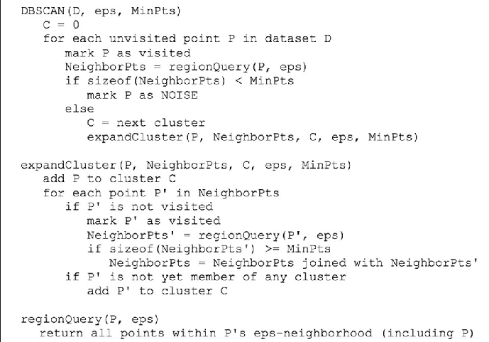

    Results:

    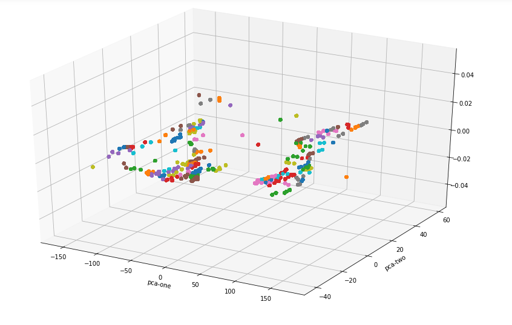

    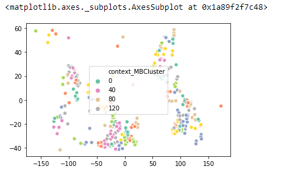

    Evaluation Accuracy: 0.09096141

**Similarity Between Users and Venue:**

1.  **Matrix Factorization:**

2.  When a user gives feed back to a certain movie they saw (say they can rate
    from one to five), this collection of feedback can be represented in a form
    of a matrix. Where each row represents each users, while each column
    represents different movies. Obviously the matrix will be sparse since not
    everyone is going to watch every movies, (we all have different taste when
    it comes to movies).

3.  One strength of matrix factorization is the fact that it can incorporate
    implicit feedback, information that are not directly given but can be
    derived by analyzing user behavior. Using this strength we can estimate if a
    user is going to like a movie that (he/she) never saw. And if that estimated
    rating is high, we can recommend that movie to the user.

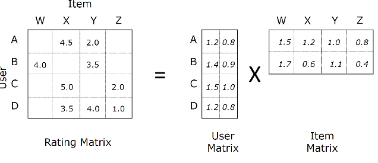

    The above image does an excellent job of summarizing, the core idea behind
    matrix factorization. Let there be matrix A with dimensionality of (m, n)
    this matrix can be viewed as a dot product between two matrix with each
    matrices having dimensions of (m, k) and (k, n).

1.  **Random Forest Classifier:**

>   A random forest consists of multiple random decision trees. Two types of
>   randomness are built into the trees. First, each tree is built on a random
>   sample from the original data. Second, at each tree node, a subset of
>   features are randomly selected to generate the best split. We use the
>   dataset below to illustrate how to build a random forest tree. Note Class =
>   XOR(X1, X2). X3 is made identical as X2 (for illustrative purposes in later
>   sections).

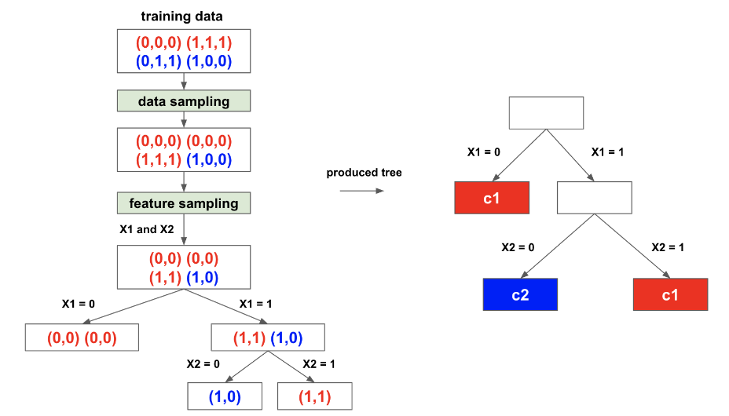

Just like we calculate cosine similarity Random Forests can be used for
unsupervised learning. These unsupervised Random Forests output similarity
matrices based on proximity. The only caveat is that the Random Forest
similarity is based on whole data, i.e. it's not pairwise calculated, you must
give it the whole data for it to learn the similarity, as it's based on the
number of times two given observations ended on the same leaf in the trees. In
other words, this means that you'd need to recalculate the whole proximity
matrix for all data every time a new observation is added.

Results:

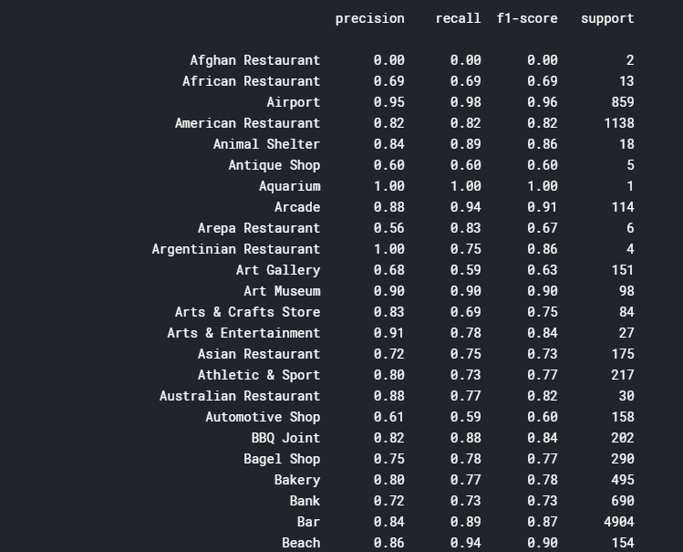

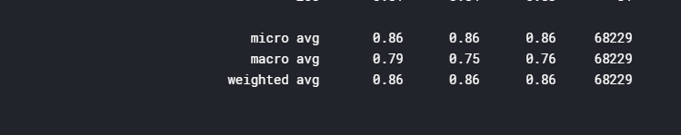

**Recommendation Part:**

In this part of all we get the current location (latitude, longitude) on the
basis of which DBSCAN and minibatch k-mean clustering is applied and get a
cluster number that is used to get the venue from the data set. Then on basis of
his preference category we get the most similar venues in that particular
category from the random forest classifier. After combining all this data, we
filter the data based on user’s visits that will recommend the top venues for
him.

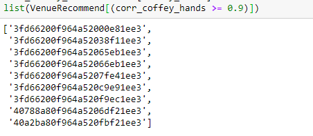

